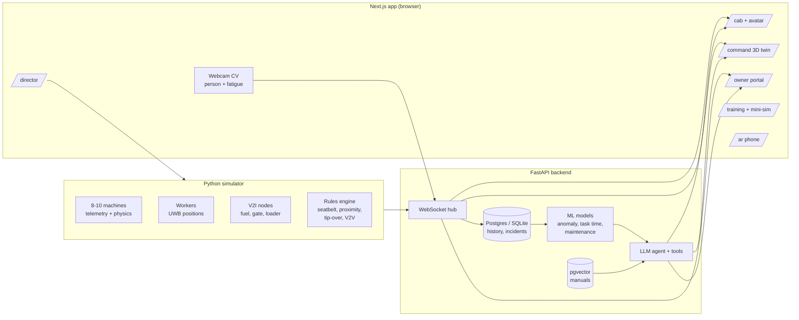

# CAT Copilot — Smart Operator Assistant for Caterpillar Machinery

> One AI brain. Every machine. Every person on site.
> A 24-hour hackathon build of an intelligent companion for operators, site managers, owners and trainees — with a live 3D digital twin, browser-based computer vision, V2V awareness, ML predictions, RAG and a talking Caterpillar avatar.

  

> **Scope note:** this README describes what we build in 24 hours. The full production architecture (edge GPUs, C-V2X, Omniverse, Kafka, federated learning, etc.) lives in [`VISION.md`](./VISION.md) and is presented in the pitch as the scale-up path.

---

## Table of contents

1. [Problem statement](#1-problem-statement)
2. [Our solution](#2-our-solution)
3. [Build strategy](#3-build-strategy)
4. [Feature list (24-hour versions)](#4-feature-list-24-hour-versions)
5. [The Caterpillar AI avatar](#5-the-caterpillar-ai-avatar)
6. [Architecture](#6-architecture)
7. [Tech stack](#7-tech-stack)
8. [App routes and screens](#8-app-routes-and-screens)
9. [Simulator and data](#9-simulator-and-data)
10. [Stream contract](#10-stream-contract)
11. [ML models](#11-ml-models)
12. [Agent, tools and RAG](#12-agent-tools-and-rag)
13. [Director panel](#13-director-panel)
14. [Repository structure](#14-repository-structure)
15. [Getting started](#15-getting-started)
16. [Team and ownership](#16-team-and-ownership)
17. [24-hour timeline](#17-24-hour-timeline)
18. [Integration checkpoints](#18-integration-checkpoints)
19. [Demo script](#19-demo-script)
20. [Risks and fallbacks](#20-risks-and-fallbacks)
21. [Demo-day rules](#21-demo-day-rules)
22. [From hackathon to production](#22-from-hackathon-to-production)
23. [Acknowledgements](#23-acknowledgements)

---

## 1. Problem statement

**Smart Operator Assistant for CAT machinery.** Construction equipment is increasingly digital, but operator tools remain basic. Build a multi-functional operator interface that acts as an **intelligent companion**, improving efficiency, safety and training throughout the workday.

| Expected outcome (from brief) | Our feature |
|---|---|
| Daily task dashboard | Cab HMI with live task cards and AI auto-reordering |
| Safety: seatbelt, proximity, incident logging, working conditions | Seatbelt escalation, live webcam person detection, fatigue detection, tip-over gauge, auto incident reports, risk score |
| Operator training hub | Training hub + browser mini-simulator + incident replay + expert ghost + booking |
| Unusual behavior (idling, unsafe patterns) | Rules + Isolation Forest with AI explanations and fuel cost |
| Task time estimation | LightGBM quantile ranges with SHAP reasons |

**Plus our additions:** V2V/V2I awareness, 3D digital twin with replay and what-if simulation, AR maintenance, RAG over manuals, voice interaction, customer portal, predictive maintenance and a talking Caterpillar avatar.

### Insight from the sample data

| Timestamp | Machine | Fuel (L) | Load cycles | Idle (min) | Seatbelt | Alert |
|---|---|---|---|---|---|---|
| 2025-05-01 08:00 | EXC001 | 5.2 | 12 | 30 | Fastened | No |
| 2025-05-01 10:00 | EXC001 | 3.8 | **2** | **55** | **Unfastened** | Yes |
| 2025-05-01 14:00 | EXC001 | 6.1 | 10 | 15 | Fastened | No |
| 2025-05-02 09:00 | EXC001 | 2.0 | **1** | **60** | **Unfastened** | Yes |

Every unfastened-seatbelt record also has the highest idling and the least productive work — the operator likely leaves the seat with the engine running. CAT Copilot detects this combined pattern, explains it and coaches the operator.

---

## 2. Our solution

One product, one brain, five surfaces, one loop:

```
SENSE  →  PROTECT  →  LOG  →  LEARN  →  TRAIN  →  IMPROVE
```

| Surface | User | Route |
|---|---|---|
| Cab HMI + avatar | Operator | `/cab` |
| Site command center (3D twin) | Site manager | `/command` |
| Customer portal | Machine owner / dealer | `/owner` |
| Training hub + mini-sim | Trainee / instructor | `/training` |
| AR maintenance | Technician / operator (phone) | `/ar` |
| Director panel (hidden) | Demo operator | `/director` |

---

## 3. Build strategy

1. **One web app, one backend, one simulator.** Everything runs in the browser — 3D, avatar, AR, CV, simulation. No Unity, no Omniverse, no Kafka.
2. **Fake the world, not the features.** A Python simulator pretends to be 8–10 machines, workers and V2I nodes, streaming over WebSocket. Every feature reads from this stream, so everything feels live and connected.
3. **A hidden director panel** triggers scenario events on cue, making the demo 100% reliable.
4. **Two things run live and for real on stage:** webcam person detection and webcam fatigue detection (pre-trained browser models, no training).
5. **Polish what the demo shows.** Five excellent screens beat ten average ones.

---

## 4. Feature list (24-hour versions)

| Feature | 24-hour implementation | Owner | Effort |
|---|---|---|---|
| Daily task dashboard | Cab task cards (now / next / later), progress, ETA; reorders when rain is triggered | P4 | Low |
| Seatbelt compliance | Simulator flag → chime → avatar voice → "travel locked" banner; compliance score | P1 + P4 | Low |
| Proximity hazards | **Live** webcam person detection + simulated UWB workers; safety bubble on cab & twin | P4 + P3 | Medium |
| Fatigue detection | **Live** MediaPipe face landmarks; eyes closed > 2 s → alert | P4 | Low |
| Tip-over physics | Moment calculation in simulator from boom angle, payload, slope; live gauge | P1 | Low |
| Working conditions | Weather, heat index, visibility, hours on shift → single risk score | P1 | Low |
| Incident logging | Event captures snapshot + sensor state; LLM drafts report; operator confirms | P2 | Low |
| V2V / V2I | Machines broadcast position + intent; linear path extrapolation flags collisions; V2I nodes (fuel bay, gate, loader queue) produce suggestions | P1 | Medium |
| Anomaly detection | Rules + Isolation Forest; LLM explanation with fuel cost | P1 + P2 | Medium |
| Task time estimation | LightGBM quantile (P10/P50/P90) + SHAP top reasons | P1 | Medium |
| Predictive maintenance | Degradation curve → "service in ~120 h" + draft work order | P1 + P2 | Low |
| 3D digital twin | R3F terrain, low-poly machines moving live, bubbles, V2V lines, click-to-inspect | P3 | High |
| Replay / time travel | Stored stream + timeline slider replays the shift in 3D | P3 | Medium |
| What-if simulation | Sliders (trucks, weather, shift length) → quick re-run → before/after metrics | P1 + P3 | Medium |
| Heatmaps | Near-miss and idle heatmap layers on the twin | P3 | Low |
| Training mini-sim | Browser excavator: keyboard drive/swing, Rapier physics | P3 | High |
| Incident replay lesson | Recorded near-miss replayed as a training scenario | P3 | Low |
| Expert ghost | Recorded expert run shown as transparent machine next to trainee | P3 | Low |
| Training hub | Skill tree, progress rings, replay library, instructor booking calendar | P4 | Low–Med |
| AR maintenance | `<model-viewer>` on phone with tappable hotspots and step instructions | P3 | Low |
| RAG over manuals | 2–3 manuals chunked into pgvector; answers cite page numbers | P2 | Low–Med |
| AI agent | LLM with ~10 tools over live data | P2 | Medium |
| Voice | Push-to-talk → speech recognition → agent → TTS | P2 | Low |
| Caterpillar avatar | 3D character, mouth driven by TTS audio, idle/talk/alert states | P2 | Medium |
| Customer portal | Fleet cost, idle cost, carbon, utilization, maintenance calendar, AI weekly report | P4 | Medium |

---

## 5. The Caterpillar AI avatar

A friendly 3D Caterpillar site-crew character that is the single face of the system. It appears on `/cab` and `/command`, speaks, listens, and acts through the agent's tools.

**What it does in the demo**

- Gives the shift briefing and reorders tasks for rain
- Warns about the seatbelt and hazards (proactive)
- Answers "why did that alert fire?" and "how long will this trench take?"
- Drafts and files incident reports on voice confirmation
- Explains anomalies with fuel cost
- Answers manual questions with citations
- Books training and drafts work orders (with confirmation)

**How it's built**

| Part | Implementation |
|---|---|
| Model | GLB/VRM character rendered in React Three Fiber |
| Lip sync | Mouth blendshape driven by TTS audio amplitude (or the open-source TalkingHead library) |
| States | Idle, listening, thinking, talking, alert (color + animation) |
| Voice in | Browser Web Speech API with push-to-talk |
| Voice out | TTS API (browser speech as fallback) |
| Brain | LLM agent with tool calling + RAG |

**Guardrails:** the avatar never controls machine motion; safety alerts come from deterministic simulator rules, not the LLM; consequential actions need a confirm tap or "confirm" by voice.

---

## 6. Architecture



**Data flow in one sentence:** the simulator (and the browser webcam) emit events → the FastAPI hub broadcasts them to every screen and stores them → ML models and the agent read the stored history → the avatar speaks the results.

---

## 7. Tech stack

| Layer | Choice | Why |
|---|---|---|
| Frontend | Next.js, TypeScript, Tailwind, shadcn/ui, Motion | Polished UI fast |
| 3D / twin / sim | React Three Fiber + drei, Rapier physics | Everything in one browser codebase |
| Charts | ECharts or Recharts | Quick, good-looking |
| Browser CV | MediaPipe Face Landmarker; MediaPipe or TF.js object detection | Live stage demos, no training |
| AR | `<model-viewer>` | Phone AR in ~1 hour |
| Avatar | GLB/VRM in R3F, amplitude lip sync | Impressive, light |
| Backend | FastAPI + WebSockets (Python 3.11) | API, ML and agent in one service |
| Simulator | Python asyncio | Generates the whole site live |
| ML | scikit-learn, LightGBM, SHAP | Trains in minutes |
| Database | Postgres + pgvector (or SQLite + in-memory vectors) | Minimal setup |
| LLM | One LLM API with tool calling | Agent, RAG, reports, explanations |
| Voice | Web Speech API + TTS API | Minimal setup |
| Dev | Docker Compose, pnpm, uv | One-command start |

**Deliberately cut for 24 h (kept in pitch as production path):** edge GPUs, C-V2X, MQTT/Kafka/Flink, Omniverse, Isaac Sim, Chrono, Unity, Neo4j GraphRAG, LiveKit, federated learning.

---
## 8. App routes and screens

Shared design system across all routes: CAT yellow + black, dark mode default, high contrast, 56 px minimum touch targets in the cab, red reserved for danger only, icons always paired with color.

### `/cab` — Operator HMI

```
┌───────────────────────────────────────────────────────┐
│ NOW: Trench Zone B  ▸ 62%  ETA 11:40   [Avatar ●mic]  │
├──────────────┬───────────────────────┬────────────────┤
│ Task cards   │  Top-down view        │ Gauges         │
│  Now         │   + safety bubble     │  Fuel          │
│  Next        │   + V2V machines      │  Hydraulic °C  │
│  Later       │   + webcam inset      │  Tip-over      │
├──────────────┴───────────────────────┴────────────────┤
│ Alert ribbon (expands only when needed)               │
└───────────────────────────────────────────────────────┘
```

### `/command` — Site command center

```
┌───────────────────────────────────────────────────────────────┐
│ Top bar: site · shift · KPI strip · search                    │
├────────────┬──────────────────────────────────┬───────────────┤
│ Fleet list │        3D digital twin           │  Inspector    │
│ (live      │  machines · workers · bubbles    │  (selected    │
│  status)   │  V2V lines · heatmap toggle      │   machine /   │
│            │                        [Avatar]  │   incident)   │
├────────────┴──────────────────────────────────┴───────────────┤
│ Timeline scrubber · replay · what-if sliders                  │
└───────────────────────────────────────────────────────────────┘
```

### `/owner` — Customer portal
Editorial layout: AI-written weekly fleet report with inline charts, idle cost, fuel, carbon, utilization, maintenance calendar, operator leaderboard, work orders.

### `/training` — Training hub
Skill tree, progress rings, incident replay library, expert-ghost challenge, instructor booking calendar, "Launch simulator" → 3D mini-sim.

### `/ar` — AR maintenance (open on phone)
Machine model placed in AR; tappable hotspots (engine air filter, hydraulic tank, track tension) each show step-by-step instructions with a manual citation.

### `/director` — Hidden demo control
See [section 13](#13-director-panel).

---

## 9. Simulator and data

### Site

- **Site:** Chennai demo site (realistic coordinates), 3 zones, 1 haul road, 1 fuel bay, 1 gate
- **Machines:** EXC001, EXC002 (320 excavators), WHL001 (950 wheel loader), DOZ001 (D6 dozer), TRK001–TRK004 (745 articulated trucks), GRD001 (140 motor grader)
- **Operators:** OP1001–OP1010 with skill levels
- **Workers:** 4–6 ground workers with simulated UWB positions

### Signals generated per machine (1 Hz)

Engine hours, fuel used, fuel level, load cycles, idle time, seatbelt status, speed, heading, position, boom/stick/swing angles, payload, hydraulic temp, coolant temp, pitch/roll, tip-over margin, fault codes, operator ID, current task.

### Tip-over margin (simplified physics)

```
margin = M_restoring / M_overturning
M_overturning = Σ (m_i · g · d_i)   # boom, stick, bucket, payload about tipping line
M_restoring   = m_base · g · d_base # upper structure + undercarriage + counterweight
d_i from joint angles, swing angle and slope (pitch/roll)
Green > 1.5 · Amber 1.2–1.5 · Red < 1.2
```

### Historical data (for ML)

| Dataset | Size |
|---|---|
| Telemetry history | 30 days × 10 machines, 1-minute resolution |
| Task logs (task type, weather, skill, machine, soil, volume, estimated, actual) | ~5,000 tasks |
| Injected anomalies (idling, belt-off, overload, harsh swings) | ~5% of sessions |
| Near-miss incidents | ~150 events with positions for replay/heatmaps |
| Maintenance degradation | Per machine hydraulic/engine health curves |

Generated with `make data` (numpy/pandas + Faker, seeded for reproducibility).

---

## 10. Stream contract

Locked in hour 0–2. Every screen consumes these two message types over `ws://localhost:8000/ws/live`.

**Machine state (every second per machine)**

```json
{
  "type": "machine_state",
  "ts": "2026-09-23T10:15:02Z",
  "machine_id": "EXC001",
  "model": "320",
  "operator_id": "OP1001",
  "pos": { "x": 120.4, "y": 88.1, "lat": 13.0827, "lon": 80.2707 },
  "heading_deg": 142.5,
  "speed_mps": 1.2,
  "intent": "swing_left",
  "engine_hours": 1523.5,
  "fuel_level_pct": 64,
  "fuel_used_l": 5.2,
  "load_cycles": 12,
  "idle_min": 30,
  "seatbelt": "fastened",
  "payload_kg": 1850,
  "hydraulic_temp_c": 71,
  "pitch_deg": 4.1,
  "roll_deg": 1.3,
  "tip_over_margin": 1.62,
  "bubble": "green",
  "task_id": "T-0042",
  "task_progress": 0.62
}
```

**Event (whenever something happens)**

```json
{
  "type": "event",
  "ts": "2026-09-23T10:15:04Z",
  "event": "proximity_alert",
  "severity": "high",
  "machine_id": "EXC001",
  "source": "webcam | simulator | v2v | rules | ml",
  "data": { "distance_m": 2.8, "zone": "rear" }
}
```

**Event types:** `seatbelt_unfastened`, `proximity_alert`, `fatigue_alert`, `tip_over_warning`, `v2v_collision_risk`, `v2i_suggestion`, `anomaly_detected`, `incident_created`, `maintenance_due`, `weather_change`, `task_reordered`.

**Key REST endpoints**

| Method | Endpoint | Purpose |
|---|---|---|
| GET | `/api/fleet` | All machines, latest state |
| GET | `/api/machines/{id}/history` | Telemetry history |
| POST | `/api/tasks/estimate` | Task time range + SHAP reasons |
| GET | `/api/anomalies` | Detected anomalies with explanations |
| POST | `/api/incidents` | Create incident |
| POST | `/api/whatif` | Run what-if scenario |
| POST | `/api/assistant` | Agent chat (text) |
| POST | `/api/director/{scenario}` | Trigger demo scenario |

---

## 11. ML models

| Model | Method | Output | Trained on |
|---|---|---|---|
| Task time | LightGBM quantile regression (P10/P50/P90) + SHAP | "2 h 10 m (1 h 50 m – 2 h 40 m); rain +25 min" | Task logs |
| Anomaly | Rules + Isolation Forest | Anomaly type + score | Telemetry history |
| Explanation | LLM over anomaly + context | Plain-language explanation with fuel cost | — |
| Maintenance | Degradation curve fit | Hours until service | Health curves |
| V2V collision | Linear path extrapolation (3–5 s) + distance threshold | Risk + time to conflict | Live stream |
| What-if | Fast re-run of simulator logic | Throughput, fuel, idle, risk before vs after | Live parameters |
| Person detection | Pre-trained browser model | Person present + box size (≈ distance) | Pre-trained |
| Fatigue | MediaPipe eye aspect ratio | Eyes closed duration | Pre-trained |

Train everything with `make train` (< 5 minutes on a laptop).

---

## 12. Agent, tools and RAG

### Tools

| Tool | Returns | Confirm? |
|---|---|---|
| `get_machine_status(machine_id)` | Latest state + faults | No |
| `get_fleet_overview()` | All machines + KPIs | No |
| `get_shift_tasks(operator_id)` | Tasks for today | No |
| `reorder_tasks(reason)` | New task order | Yes |
| `predict_task_time(task_id)` | Range + reasons | No |
| `get_anomalies(machine_id)` | Anomalies + fuel cost | No |
| `create_incident(details)` | Incident + draft report | Yes |
| `search_manual(query)` | Passages + page citations | No |
| `create_work_order(machine_id, issue)` | Draft work order | Yes |
| `book_training(operator_id, module)` | Booking | Yes |
| `run_what_if(params)` | Before/after metrics | No |

### RAG

- 2–3 manuals / safety documents chunked (~500 tokens) and embedded into pgvector
- Top-k retrieval + LLM answer with page citations
- Fault-code lookup via simple keyword match before vector search

### Cached fallbacks

Every scripted demo question has a cached response so the demo works even if the network or LLM API fails.

---

## 13. Director panel

Hidden route `/director`, run by P1 during the demo. Each button pushes events into the simulator.

| Button | Effect |
|---|---|
| Start shift | Avatar briefing; tasks load |
| Rain incoming | Weather change → tasks reorder → risk score rises |
| Unbuckle seatbelt (EXC001) | Seatbelt escalation flow |
| Worker behind EXC001 | Worker moves into rear blind spot → proximity alert (backup for webcam) |
| Fatigue | Fatigue alert (backup for webcam) |
| Dozer reversing toward EXC001 | V2V collision warning on both machines |
| Heavy lift on slope | Tip-over gauge goes amber/red |
| Hydraulic temp spike | Maintenance warning + work order draft |
| Inject idle anomaly | Anomaly appears in owner portal |
| Reset | Clean state |

---

## 14. Repository structure

```
cat-copilot/
├── web/                     # Next.js app (all routes)
│   ├── app/
│   │   ├── cab/
│   │   ├── command/
│   │   ├── owner/
│   │   ├── training/
│   │   ├── ar/
│   │   └── director/
│   ├── components/
│   │   ├── ui/              # shadcn + design tokens
│   │   ├── twin/            # R3F scene, machines, bubbles, heatmaps
│   │   ├── sim/             # training mini-sim, ghost
│   │   ├── avatar/          # avatar model + lip sync
│   │   └── cv/              # webcam person + fatigue detection
│   ├── lib/                 # WebSocket client, stream types
│   └── public/models/       # GLB machines, avatar, AR model
├── backend/
│   ├── main.py              # FastAPI + WebSocket hub
│   ├── agent/               # LLM agent, tools, cached responses
│   ├── rag/                 # indexing + retrieval
│   ├── ml/                  # training + inference
│   └── db/                  # models, seed
├── simulator/
│   ├── sim.py               # live site simulator
│   ├── physics.py           # tip-over margin
│   ├── v2x.py               # V2V/V2I logic
│   └── scenarios.py         # director scenarios
├── data-gen/                # historical synthetic data
├── docs/                    # pitch deck, architecture slide
├── docker-compose.yml
├── Makefile
├── README.md
└── VISION.md                # full production architecture
```

---

## 15. Getting started

### Prerequisites

Node.js 20+, pnpm, Python 3.11+, uv (or pip), Docker (for Postgres + pgvector).

```bash
git clone https://github.com/<team>/cat-copilot.git && cd cat-copilot
cp .env.example .env            # add LLM and TTS keys

docker compose up -d            # Postgres + pgvector
make data                       # generate historical data
make train                      # train ML models
make index                      # build RAG index
make backend                    # FastAPI on :8000
make sim                        # live simulator
cd web && pnpm install && pnpm dev   # app on :3000
```

Open `/cab`, `/command`, `/owner`, `/training` on the laptop, `/ar` on a phone (same network, HTTPS via tunnel), and `/director` on a second device.

### Environment variables

| Variable | Purpose |
|---|---|
| `LLM_API_KEY`, `LLM_MODEL` | Agent |
| `TTS_API_KEY` | Avatar voice |
| `DATABASE_URL` | Postgres |
| `USE_CACHED_RESPONSES` | `true` forces demo fallbacks |

---
## 16. Team and ownership

| Person | Track | Owns |
|---|---|---|
| **P1 — The World** | Simulator, data, ML, director | Live simulator, tip-over physics, V2V/V2I logic, historical data, anomaly/task-time/maintenance models, what-if engine, director panel, pitch deck & architecture slide |
| **P2 — The Brain** | Backend, agent, RAG, voice, avatar | FastAPI + WebSocket hub, LLM agent + tools, RAG, incident reports, voice loop, avatar component + lip sync, cached fallbacks |
| **P3 — The 3D** | Twin, replay, sim, AR | R3F command center twin, bubbles, V2V lines, heatmaps, timeline replay, training mini-sim + expert ghost, AR page |
| **P4 — The Product** | Design system, 2D screens, webcam CV | Design system & app shell, cab HMI, customer portal, training hub UI, webcam person + fatigue detection, route integration |

**Shared contracts (decided together in hours 0–2):** stream message format, machine/site IDs, agent tool list, routes + design tokens, demo script.

---

## 17. 24-hour timeline

| Hours | P1 — World | P2 — Brain | P3 — 3D | P4 — Product |
|---|---|---|---|---|
| **0–2** | *All together:* contracts, IDs, tools, design tokens, demo script. P1 ships a fake stream sender within 30 min. | | | |
| **2–6** | Simulator streaming all machines + workers; seatbelt/idle/load/fuel logic | FastAPI + WS hub; agent skeleton with 3 tools | Terrain + machines moving from live stream | Design system, app shell, cab HMI with live task cards and gauges |
| **6–10** | Historical data; train anomaly + task-time models; tip-over calc | Remaining tools; RAG; incident reports | Safety bubbles, V2V lines, click-to-inspect | Webcam person detection → stream event; fatigue detection |
| **10–14** | V2V collision prediction; maintenance curve; what-if engine | Voice loop; avatar rendering + lip sync | Timeline replay; heatmaps; start mini-sim | Customer portal; alert escalation in cab |
| **14–18** | Director panel; wire the full demo scenario | Avatar in cab + command; cached fallbacks | Mini-sim + expert ghost; AR page | Training hub UI; integrate all routes |
| **18–21** | Pitch deck, architecture slide, metrics | Avatar personality, voice lines polish | Lighting, camera moves, transitions | UI polish, empty states, animations |
| **21–24** | Rehearse ×3, record backup video, buffer | Rehearse, buffer | Rehearse, buffer | Rehearse, buffer |

**Sleep in pairs:** P1 + P3 around hours 10–13, P2 + P4 around hours 13–16.

---

## 18. Integration checkpoints

| Hour | Checkpoint (15 min, everyone) |
|---|---|
| 6 | Simulator data visible live in `/cab` and `/command` |
| 12 | Agent answers from real stream data; webcam detection appears as an alert on the twin |
| 18 | Full demo runs end to end from `/director` → **feature freeze** |
| 21 | First timed full rehearsal |

---

## 19. Demo script

Four minutes. Presenter: P4. Operator voice: P2. Director panel: P1. Webcam walk-in + phone AR: P3.

| Time | Scene | What judges see |
|---|---|---|
| 0:00 | **Hook** | "In the sample data you gave us, every seatbelt violation also had the most idling and least work. Our copilot caught that." |
| 0:20 | **Shift start** | Avatar voice briefing on `/cab`; *Rain incoming* → tasks reorder, risk score rises |
| 0:50 | **Seatbelt** | Unbuckle → chime → avatar warning → "travel locked" banner |
| 1:10 | **Live proximity** | P3 walks into the webcam → bubble turns red on cab and twin |
| 1:30 | **Live fatigue** | P2 closes eyes → fatigue alert, avatar suggests a break |
| 1:45 | **V2V** | Dozer reversing → collision warning on both machines in the twin |
| 2:00 | **Incident** | Avatar drafts report → "confirm" by voice → appears in command center |
| 2:20 | **Replay + what-if** | Scrub timeline to replay the near-miss in 3D; add a spotter/reroute trucks → before vs after |
| 2:45 | **Ask the avatar** | "How long will this trench take?" → range + reasons. "What does fault X mean?" → manual citation |
| 3:05 | **Owner portal** | Idle anomaly with fuel cost, predicted maintenance date, AI weekly report |
| 3:25 | **AR** | Phone shows the machine in AR; tap filter hotspot for steps |
| 3:40 | **Training** | Same near-miss as a lesson; trainee vs expert ghost in mini-sim |
| 3:55 | **Close** | "Sense → protect → log → learn → train → improve. One copilot for everyone on site." + production path slide |

---

## 20. Risks and fallbacks

| Risk | Fallback |
|---|---|
| 3D twin runs late | 2D map (deck.gl) for command center; 3D only for replay |
| Mini-sim too hard | Replay-only mode (incident + expert ghost), no driving |
| Avatar lip sync glitchy | 2D animated avatar with talking animation |
| Wi-Fi / LLM API fails | `USE_CACHED_RESPONSES=true` + backup video |
| Webcam unreliable in venue light | Director panel triggers identical alerts |
| Phone AR fails | Show AR screen recording |
| Laptop dies | Backup video + second laptop with repo pulled |

---

## 21. Demo-day rules

- **Feature freeze at hour 18.** After that: fixes and polish only.
- **Precompute anything slow** — models trained, RAG indexed, demo responses cached.
- **Data must look real** — real Cat model names, realistic values, Chennai coordinates.
- **Polish the screens the demo shows** before adding anything new.
- **Rehearse at least three times** with a timer; record the best run as backup.
- **Bring:** charger, phone hotspot, HDMI adapter, spare webcam.

---

## 22. From hackathon to production

What we built maps directly onto a production architecture (see [`VISION.md`](./VISION.md)):

| Hackathon | Production |
|---|---|
| Python simulator | Cat Product Link / VisionLink data via ISO 15143-3 (AEMP 2.0) API + retrofit sensors |
| Browser webcam CV | Edge GPU (Jetson) with cameras, radar, UWB fusion |
| Simulated V2V over WebSocket | C-V2X with PKI-signed messages |
| FastAPI WebSocket hub | MQTT Sparkplug B + Kafka + Flink |
| R3F twin | Omniverse / OpenUSD twin with Gaussian-splat site scans |
| Browser mini-sim | Unity/Unreal + Project Chrono VR simulator |
| `<model-viewer>` AR | Unity AR Foundation, HUD, remote expert |
| pgvector RAG | Hybrid + GraphRAG + multimodal retrieval |
| Single LLM agent | Multi-agent system over MCP tools with long-term memory |
| Rules-based safety in simulator | Deterministic edge safety engine, offline-capable |

---

## 23. Acknowledgements

- Built in 24 hours for the *Smart Operator Assistant for CAT machinery* hackathon.
- Caterpillar, CAT, VisionLink and Product Link are trademarks of Caterpillar Inc. This is an independent prototype using synthetic data.
- Thanks to the open-source projects that made this possible: Next.js, React Three Fiber, Rapier, MediaPipe, model-viewer, FastAPI, LightGBM, SHAP, pgvector.
