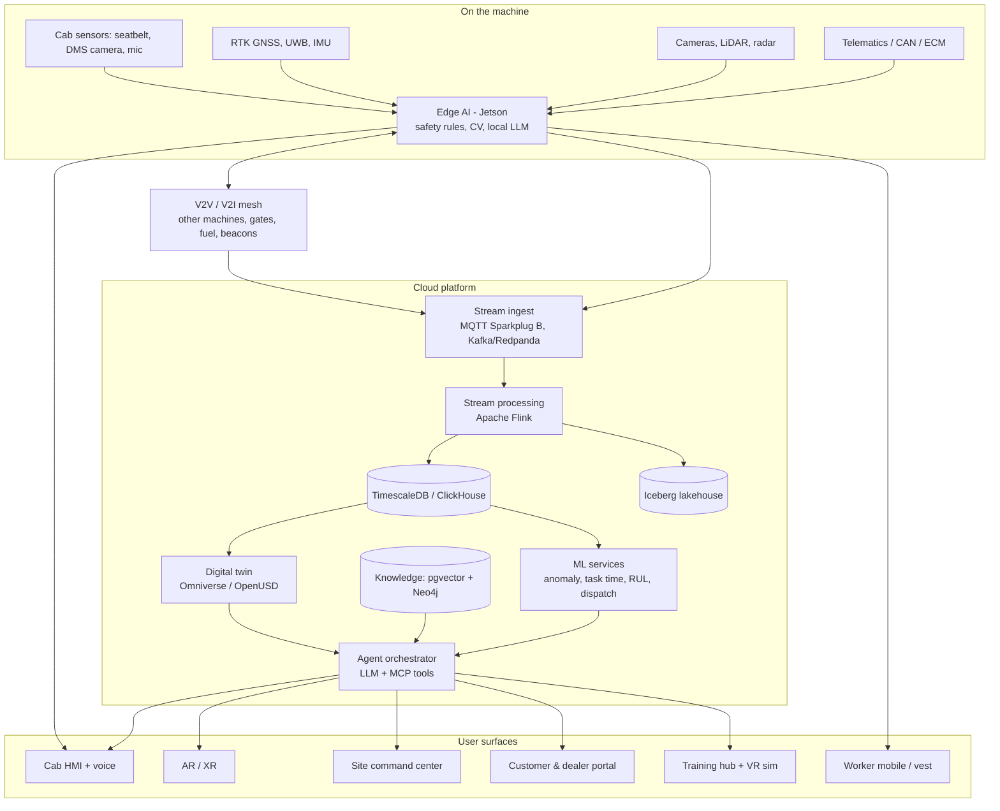
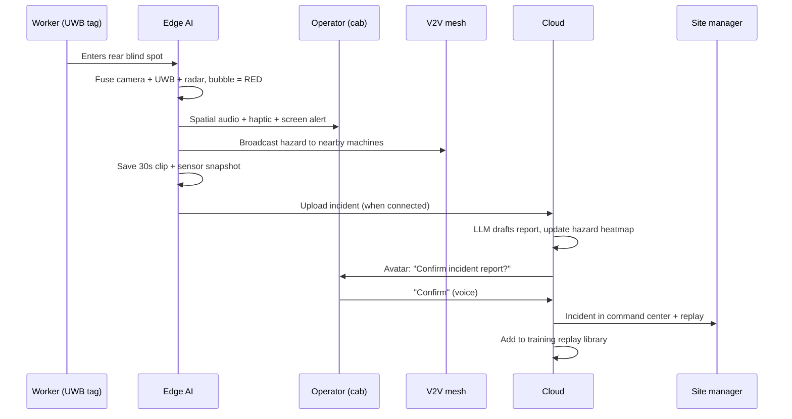
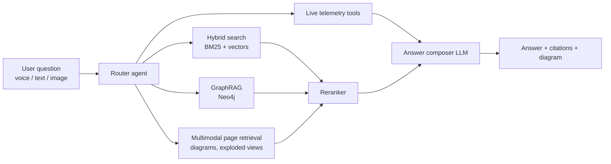
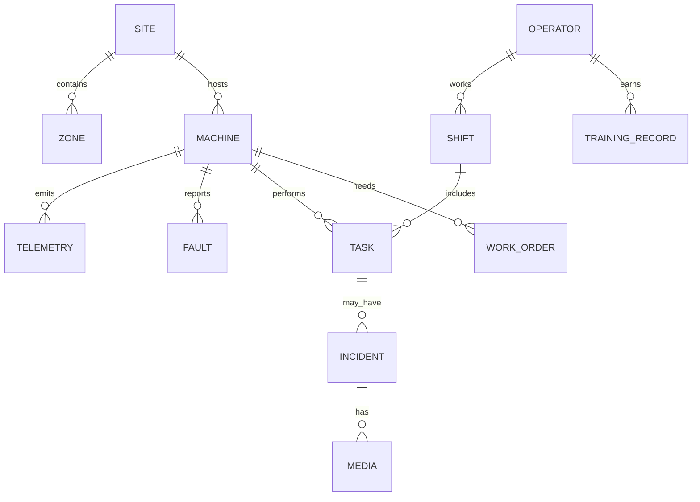

# CAT Copilot — Smart Operator Assistant for Caterpillar Machinery

> One AI brain. Every machine. Every person on site.
> An end-to-end intelligent companion for operators, site managers, owners, dealers and trainees — powered by edge AI, physics-based simulation, digital twins, AR, RAG and a conversational 3D Caterpillar avatar.

  

---

## Table of contents

1. [Problem statement](#1-problem-statement)
2. [Our solution](#2-our-solution)
3. [Who it is for](#3-who-it-is-for)
4. [Feature overview](#4-feature-overview)
5. [The Caterpillar AI avatar](#5-the-caterpillar-ai-avatar)
6. [System architecture](#6-system-architecture)
7. [Technology map — where each tech fits](#7-technology-map--where-each-tech-fits)
8. [Simulation and physics](#8-simulation-and-physics)
9. [AI and machine learning models](#9-ai-and-machine-learning-models)
10. [RAG and knowledge layer](#10-rag-and-knowledge-layer)
11. [Agents and MCP tools](#11-agents-and-mcp-tools)
12. [AR / XR](#12-ar--xr)
13. [V2V / V2I](#13-v2v--v2i)
14. [Frontend and UX](#14-frontend-and-ux)
15. [Data sources](#15-data-sources)
16. [Data model and schemas](#16-data-model-and-schemas)
17. [APIs, events and MQTT topics](#17-apis-events-and-mqtt-topics)
18. [Repository structure](#18-repository-structure)
19. [Getting started](#19-getting-started)
20. [Demo script](#20-demo-script)
21. [Safety, privacy and security](#21-safety-privacy-and-security)
22. [Success metrics](#22-success-metrics)
23. [Roadmap](#23-roadmap)
24. [Team roles](#24-team-roles)
25. [Problem → solution map (full)](#25-problem--solution-map-full)
26. [License and acknowledgements](#26-license-and-acknowledgements)

---

## 1. Problem statement

**Smart Operator Assistant for CAT machinery.**

Construction equipment such as excavators and loaders is becoming increasingly digital, yet the tools available to machine operators remain basic. The challenge is to design and build a multi-functional operator interface for CAT machine operators — not just a tool, but an **intelligent companion** that improves efficiency, safety and training throughout the operator's day.

**Expected outcomes from the brief:**

| # | Expected outcome | Where we address it |
|---|---|---|
| 1 | Daily task dashboard — view scheduled tasks for the day | [Shift briefing & task planner](#41-shift-briefing-and-task-planner) |
| 2 | Safety features — seatbelt compliance, proximity hazards, incident logging, working conditions | [Safety suite](#42-safety-suite) |
| 3 | Operator training hub — e-learning, instructor booking or simulation | [Training hub & simulator](#46-training-hub-and-simulator) |
| 4 | Identify unusual machine usage (excessive idling, unsafe patterns) | [Behavior & anomaly detection](#44-behavior-and-anomaly-detection) |
| 5 | Task time estimation from past data and environmental conditions | [Task time estimation](#45-task-time-estimation) |

### Insight from the sample data

The telemetry sample in the brief already hides a pattern:

| Timestamp | Machine | Operator | Engine hrs | Fuel (L) | Load cycles | Idle (min) | Seatbelt | Safety alert |
|---|---|---|---|---|---|---|---|---|
| 2025-05-01 08:00 | EXC001 | OP1001 | 1523.5 | 5.2 | 12 | 30 | Fastened | No |
| 2025-05-01 10:00 | EXC001 | OP1001 | 1524.8 | 3.8 | **2** | **55** | **Unfastened** | Yes |
| 2025-05-01 14:00 | EXC001 | OP1001 | 1526.5 | 6.1 | 10 | 15 | Fastened | No |
| 2025-05-02 09:00 | EXC001 | OP1001 | 1530.2 | 2.0 | **1** | **60** | **Unfastened** | Yes |

Every unfastened-seatbelt record also shows the **highest idling** and the **lowest productive work**. That strongly suggests the operator leaves the seat (or takes a break) with the engine running — a safety risk *and* a fuel-waste problem. CAT Copilot is designed to catch exactly this kind of correlated behavior, explain it in plain language and coach the operator.

---

## 2. Our solution

**CAT Copilot** is one AI core fed by every sensor on every machine, delivered through purpose-built surfaces for each user, with a conversational **3D Caterpillar avatar** as the single face of the system.

The product follows one loop:

```
SENSE  →  PROTECT  →  LOG  →  LEARN  →  TRAIN  →  IMPROVE
```

- **Sense:** telematics, cameras, LiDAR, radar, RTK GNSS, UWB tags, cab sensors, wearables, drones.
- **Protect:** millisecond safety decisions at the edge (seatbelt, proximity, rollover, fatigue, V2V collision warnings).
- **Log:** automatic incident capture with video, sensor snapshots and AI-written reports.
- **Learn:** ML models for anomalies, task time, predictive maintenance and fleet optimization.
- **Train:** real incidents replayed in a physics-accurate simulator; personalized coaching.
- **Improve:** managers and owners see ROI, safety trends and what-if simulations in a live digital twin.

### Design principles

1. **Edge-first safety.** Safety alerts never depend on the cloud or the LLM.
2. **Voice-first in the cab.** Operators have their hands and eyes busy.
3. **Spatial-first UI.** The site is a place, so the interface is a map/twin, not a grid of cards.
4. **Explain everything.** Every prediction and suggestion comes with reasons and sources.
5. **Coaching, not surveillance.** Operators see and own their data.
6. **Human in the loop.** The AI suggests; people confirm anything consequential.

---

## 3. Who it is for

| Persona | Main surface | What they get |
|---|---|---|
| Machine operator | Cab HMI + voice + avatar + AR | Shift briefing, live safety bubble, voice commands, coaching, task timers |
| Ground worker | Mobile app / smart vest | Proximity haptics, SOS, nearby-machine map |
| Site manager / supervisor | Site command center | Live 3D twin, fleet status, incidents, dispatch, what-if simulation, replay |
| Machine owner / customer | Customer portal | Utilization, cost, fuel, carbon, maintenance forecasts, safety scores |
| Dealer / service technician | Dealer portal + AR maintenance | Predicted failures, auto work orders, remote expert AR sessions |
| Trainee / instructor | Training hub + VR simulator | Skill tree, incident replays, expert-ghost challenges, instructor booking |

---

## 4. Feature overview

### 4.1 Shift briefing and task planner

- Voice + visual briefing when the operator logs in: tasks, weather, machine health, site hazards.
- Tasks are **auto-sequenced** using a constraint solver (weather windows, site congestion, machine readiness, operator skill).
- Live progress tracking per task with predicted finish time.
- Example: *"Rain is likely after 2 PM, so start with the trench in Zone B. Hydraulic temperature ran high yesterday — please check the fluid level during your walkaround."*

### 4.2 Safety suite

| Feature | How it works |
|---|---|
| **Seatbelt compliance** | Buckle + seat-pressure fusion. Escalation: chime → avatar voice → soft travel lock (configurable). Per-operator compliance score. |
| **Proximity hazards (safety bubble)** | Camera detection (YOLO) + monocular depth + radar + UWB worker tags fused on the edge GPU. The bubble grows with travel speed and boom swing radius. |
| **Rollover / stability** | Real-time tip-over margin computed from boom/stick angles, bucket load, slope (IMU) and swing speed. |
| **Fatigue & heat stress** | Driver-monitoring camera (PERCLOS, head nods), voice stress detection, wearable heart rate, heat index. Break suggestions. |
| **Terrain & utilities** | LiDAR/drone terrain mapping, slope warnings, buried utility lines shown in AR. |
| **Automatic incident logging** | Event-triggered 30-second clip + sensor snapshot; the LLM drafts the report; operator confirms by voice. Tamper-evident log. |
| **Working conditions** | Live risk score per task from weather, visibility, dust, noise, ground conditions and time on shift. |
| **Emergency SOS** | Impact/rollover detection triggers automatic SOS with precise location to the site team, with satellite messaging fallback. |
| **Fleet hazard heatmaps** | Near-misses from all machines aggregate into zone-level risk maps; operators get warned when approaching a known risky zone. |

### 4.3 Machine-to-machine and infrastructure awareness (V2V / V2I)

See [section 13](#13-v2v--v2i).

### 4.4 Behavior and anomaly detection

- **Rules** (explainable): idle > N minutes, belt-off while engine on, overload, over-rev, operating beyond safe slope.
- **ML**: LSTM autoencoders and Isolation Forest on multivariate telemetry; time-series foundation model residuals.
- **Correlation mining**: detects combined patterns (e.g., *belt unfastened + high idle + low cycles*).
- **Explanation**: the LLM converts each anomaly into plain language with cost impact — *"Idling was 3× your usual on Tuesday afternoon, costing about 8 L of fuel."*
- **Coaching** rather than punishment: tips, training suggestions, positive reinforcement.

### 4.5 Task time estimation

- Model: LightGBM with **quantile regression** + **conformal prediction** for calibrated ranges.
- Inputs: task type, soil/material, volume, weather, temperature, visibility, operator skill and history, machine model and health, site congestion, time of day.
- Output: *"2 h 10 m (likely 1 h 50 m – 2 h 40 m)"* with **SHAP** reasons: *"rain +25 min, operator experience −10 min."*
- Continuously re-estimates during the task using live progress.
- Estimated vs actual is logged to retrain the model.

### 4.6 Training hub and simulator

- **Physics-accurate simulator** (Unity/Unreal + Project Chrono) in VR (Meta Quest 3) or on a desktop rig with force-feedback joysticks.
- **Incident replay**: real near-misses are reconstructed from sensor logs inside the simulator.
- **Race the expert ghost**: veteran operators' telemetry is replayed as a ghost machine; trainees try to match cycle time and smoothness.
- **Adaptive curriculum**: skill profile built from real telemetry; the AI recommends modules.
- **Formats**: micro-learning videos, interactive quizzes, VR scenarios, instructor booking.
- **AI coach** inside the simulator giving live feedback via the avatar.
- **Digital operator passport**: verifiable skill credentials.

### 4.7 Predictive maintenance

- Remaining-useful-life models on vibration, oil analysis, temperatures, pressures and fault codes.
- Physics-informed neural networks for hydraulic temperature and component wear.
- Automatic parts ordering and dealer work orders (with confirmation).
- AR-guided maintenance steps.

### 4.8 Fleet optimization

- Live dispatch suggestions (truck queues, haul road choice, fueling windows).
- Agent-based "what-if" simulation before changing the plan.
- Reinforcement-learning dispatch policy trained in the digital twin.

### 4.9 Customer and owner insights

- Utilization, cost per task, fuel and idle cost, carbon reporting.
- Maintenance calendar with predicted service dates.
- Operator leaderboards (safety + efficiency).
- AI-written weekly fleet report.
- Safety score export (useful for usage-based insurance).

---
## 5. The Caterpillar AI avatar

A conversational, 3D, lip-synced Caterpillar character that is the **single point of contact** for the whole system. The same avatar, memory and tools appear on the cab screen, as a hologram in AR, on the command center, in the customer app and as the instructor inside the simulator.

### What it can do

| Capability | Example |
|---|---|
| Answer anything about the machine | *"What does this warning light mean?"* (points phone camera at it) |
| Act on the system | *"Log a hazard here."* · *"Book me a slope-training session."* · *"Raise a work order for the hydraulic leak."* |
| Predict and plan | *"How long will this trench take?"* · *"Reorder my tasks for the rain."* |
| Explain | *"Why did that alert fire?"* · *"Why is my fuel use high this week?"* |
| See the scene | *"Is it safe to dig here?"* — reasons over live camera, utility maps and proximity sensors |
| Be proactive | *"Heads up: the dozer behind you is reversing."* |
| Adapt to the person | Short and urgent with operators, analytical with managers, business-focused with owners |
| Remember | Per-operator habits, skill gaps, preferences across shifts |
| Read emotion | Detects stress or fatigue in voice tone and suggests a break |
| Speak local languages | English, Tamil, Hindi and more, with translation on the fly |
| Teach | Acts as instructor in VR, demonstrating moves and giving feedback |

### Avatar technology

| Component | Technology |
|---|---|
| 3D character | Custom stylized site-crew character (Blender) or Unreal MetaHuman |
| Facial animation & lip sync | NVIDIA Audio2Face (high fidelity) or TTS viseme data driving blendshapes in React Three Fiber (web) |
| Real-time voice | LiveKit Agents or Pipecat, streaming STT/TTS, barge-in / interruption handling, neural noise suppression |
| Wake / push-to-talk | Local wake word + joystick push-to-talk button |
| Brain | LLM with tool use via MCP, multi-agent orchestration (LangGraph) |
| Knowledge | Hybrid RAG + GraphRAG + multimodal RAG over manuals |
| Vision | Vision-language model over cab/phone camera frames |
| Memory | Long-term memory store per user and per site |
| Offline mode | Small on-device LLM (llama.cpp / Ollama on Jetson) for core commands |

### Avatar guardrails

- Never takes safety-critical physical actions (no moving the machine, no disabling alerts).
- Consequential actions (orders, locks, reports sent externally) require explicit confirmation.
- Every action and answer is logged with its reasoning and sources.
- Safety alerts come from the deterministic edge rules engine, not the LLM.

---

## 6. System architecture

### 6.1 High-level



### 6.2 Edge vs cloud split

| Runs on the edge (milliseconds, works offline) | Runs in the cloud (seconds, heavy compute) |
|---|---|
| Seatbelt interlock logic | Task time prediction |
| Person/vehicle detection & safety bubble | Fleet-wide anomaly models |
| Tip-over margin | Predictive maintenance (RUL) |
| Fatigue detection | Digital twin & what-if simulation |
| V2V collision warnings | RAG, GraphRAG, full LLM agent |
| Incident clip capture | Reports, analytics, dashboards |
| Offline voice commands (small LLM) | Training content & sim orchestration |

> Why this matters: cloud telematics typically reports in minutes (cellular) or hours (satellite). That is fine for fleet analytics, but far too slow for safety. CAT Copilot handles real-time safety on the machine.

### 6.3 Incident flow (sequence)



---

## 7. Technology map — where each tech fits

| Layer | Technologies | Role |
|---|---|---|
| Sensing | CAN/J1939, ECM telematics, cameras, LiDAR, mmWave radar, RTK GNSS, UWB, IMU, DMS camera, microphones, wearables, drones | Raw data |
| Edge compute | NVIDIA Jetson Orin / Thor, TensorRT, ONNX Runtime, ROS 2 | Real-time safety & perception |
| Connectivity | C-V2X sidelink, MQTT 5 + Sparkplug B, Eclipse Zenoh, private 5G, LEO satellite backhaul | Machine ↔ machine ↔ cloud |
| Streaming | Kafka / Redpanda, Apache Flink | Real-time event processing |
| Storage | TimescaleDB / ClickHouse, PostgreSQL, Apache Iceberg, MinIO/S3, DuckDB | Telemetry, relational, lake, analytics |
| Simulation & physics | NVIDIA Omniverse (OpenUSD), Isaac Sim + Replicator, Project Chrono, DEM, SimPy / Mesa, Gymnasium | Digital twin, synthetic data, training, what-if |
| 3D capture | Drone photogrammetry, Gaussian splatting | Photoreal site reconstruction |
| ML | PyTorch, scikit-learn, LightGBM/XGBoost, MAPIE, SHAP, Chronos / TimesFM / Moirai, YOLO, SAM 2, Depth Anything, MediaPipe, Flower (federated) | Predictions, perception, anomalies |
| MLOps | MLflow, Feast (feature store), Evidently (drift) | Model lifecycle |
| Knowledge | pgvector / Qdrant, Neo4j, BM25, rerankers, ColPali-style multimodal retrieval | RAG / GraphRAG |
| Agents | LLM with tool use, MCP servers, LangGraph, long-term memory | Reasoning & action |
| Voice | LiveKit Agents / Pipecat, streaming STT/TTS, noise suppression, speech emotion recognition | Voice-first interaction |
| Avatar | Blender / MetaHuman, Audio2Face, React Three Fiber | Face of the system |
| AR / XR | Unity + AR Foundation (ARKit/ARCore), WebXR, Meta Quest 3, Apple Vision Pro, WebRTC | Overlays, maintenance, training |
| Backend | FastAPI (Python), NestJS (optional), gRPC, WebSockets | Services & APIs |
| Frontend | Next.js, React, TypeScript, Tailwind, shadcn/ui, Motion, R3F, deck.gl, MapLibre, ECharts, Liveblocks/Yjs | All web surfaces |
| Mobile / cab | React Native (Expo) or Flutter, Tauri kiosk | Cab HMI, worker app |
| Security | PKI-signed V2X, zero trust, OAuth2/OIDC, hash-chained audit logs | Trust |
| Infra | Docker, Kubernetes (k3s at edge), Terraform, GitHub Actions | Deployment |

---

## 8. Simulation and physics

| Component | Technology | Purpose |
|---|---|---|
| Site digital twin | Omniverse / OpenUSD (+ web twin in React Three Fiber) | Live 3D replica of machines, workers, stockpiles, roads |
| Machine dynamics | Project Chrono (vehicle + deformable terrain) | Realistic digging, travel on slopes, load behavior |
| Soil / granular material | Discrete element method (DEM) | Bucket fill, material flow, load estimation |
| Stability model | Rigid-body statics (CoG, tipping lines, moments) | Real-time tip-over margin in the cab |
| Hybrid physics-ML | Physics-informed neural networks (PINNs) | Hydraulic temperature, wear, fuel burn |
| Sensor simulation | Isaac Sim + Replicator | Synthetic camera/LiDAR data with perfect labels for CV training |
| Site traffic | SimPy / Mesa agent-based simulation | What-if: add truck, close road, rain arrives |
| Optimization | Reinforcement learning (Gymnasium + Stable-Baselines3) | Learn dispatch and routing policies |
| Training sim | Unity/Unreal + Chrono + VR + force-feedback joysticks | Operator training & incident replay |
| Photoreal environment | Gaussian splatting from drone footage | Realistic site in twin and simulator |

### 8.1 Tip-over margin (simplified)

For a tracked excavator the stability margin is the restoring moment of the machine about the active tipping line divided by the overturning moment from boom, stick, bucket and load:

```
margin = M_restoring / M_overturning
M_overturning = Σ (m_i · g · d_i)       # boom, stick, bucket, payload about tipping line
M_restoring   = m_base · g · d_base      # upper + undercarriage + counterweight
d_i depends on joint angles, swing angle and ground slope (from IMU)
```

The cab shows the margin as a gauge: green (> 1.5), amber (1.2–1.5), red (< 1.2). Thresholds are configurable per model using public machine spec sheets.

### 8.2 What-if simulation

Managers drag sliders (weather, number of trucks, shift length, road closure). The agent-based model re-runs the shift in seconds and shows predicted throughput, fuel, idle time and risk side by side with the current plan.

---

## 9. AI and machine learning models

| Model | Type | Inputs | Output | Runs |
|---|---|---|---|---|
| Person/vehicle detector | YOLO (fine-tuned on synthetic + real) | Camera frames | Boxes + classes | Edge |
| Distance estimation | Depth Anything + radar/UWB fusion | Frames, radar, UWB | Distance per object | Edge |
| Scene segmentation | SAM 2 | Camera / drone imagery | Trench, stockpile, zone masks | Edge / cloud |
| Fatigue detector | MediaPipe face mesh + PERCLOS | DMS camera | Fatigue score | Edge |
| Voice stress | Speech emotion recognition | Audio | Stress level | Edge |
| Trajectory forecasting | Transformer | Positions, headings, intents | 5-second future paths | Edge |
| Behavior anomaly | LSTM autoencoder + Isolation Forest + rules | Multivariate telemetry | Anomaly score + type | Cloud (light version on edge) |
| Task time | LightGBM quantile + conformal (MAPIE) + SHAP | Task, weather, operator, machine, site | Time range + reasons | Cloud |
| Forecasting | Chronos / TimesFM / Moirai | Fuel, hours, utilization series | Forecasts | Cloud |
| Predictive maintenance | RUL deep model + PINN | Vibration, oil (fluid analysis), temps, pressures, faults | Remaining useful life | Cloud |
| Dispatch policy | Reinforcement learning | Twin state | Routing & dispatch actions | Cloud |
| Operator skill profile | Gradient boosting + clustering | Telemetry, training results | Skill vector + gaps | Cloud |
| Scene reasoning | Vision-language model | Frames + context | Natural-language safety judgment | Cloud |
| Offline assistant | Small open-weights LLM | Voice commands | Local answers/actions | Edge |

**Privacy-preserving learning:** federated learning (Flower) trains cross-fleet models without moving raw operator data.

**Model governance:** MLflow for versions, Evidently for drift, SHAP for explanations, every prediction logged with model version.

---

## 10. RAG and knowledge layer

### Sources

- Operation & maintenance manuals, service manuals, parts catalogs
- Fault codes (with symptoms, causes and fixes)
- Safety regulations (OSHA, DGMS for mining in India, relevant BIS standards) and site SOPs
- Past incident reports and near-miss analyses
- Training content and assessment results
- Machine spec sheets

### Retrieval pipeline



- **Hybrid search** — exact matching for fault codes and part numbers, semantic matching for descriptions.
- **GraphRAG** — knowledge graph `Machine → Component → Fault → Symptom → Fix → Part`, enabling reasoning like *"this code on this model usually means X; last time on this machine it was Y."*
- **Multimodal RAG** — retrieve diagram pages as images, so the avatar can show the exact exploded view.
- **Agentic RAG** — the agent chooses between manuals, telemetry, incident history and the graph.
- **Citations** — every answer links to its manual page or record.

---

## 11. Agents and MCP tools

### Multi-agent design

| Agent | Responsibilities |
|---|---|
| Supervisor | Routes requests, manages context, enforces guardrails |
| Safety agent | Explains alerts, incident reports, risk scores, hazard maps |
| Planner agent | Shift briefing, task sequencing, dispatch, what-if runs |
| Maintenance agent | Diagnostics, RUL, work orders, parts, AR guidance |
| Training agent | Skill gaps, curriculum, bookings, in-sim coaching |
| Reporting agent | Weekly reports, audits, ESG/carbon, customer summaries |

### MCP tool catalog (examples)

| Tool | Description | Confirmation needed |
|---|---|---|
| `get_machine_status(machine_id)` | Live vitals, location, faults | No |
| `get_fleet_overview(site_id)` | All machines, states, KPIs | No |
| `get_operator_profile(operator_id)` | Skills, compliance, history | No |
| `predict_task_time(task)` | Time range + SHAP reasons | No |
| `reorder_tasks(shift_id, strategy)` | Re-sequence tasks | Yes |
| `log_incident(details)` | Create incident with clip & snapshot | Yes |
| `query_incidents(filters)` | Search incident history | No |
| `search_manuals(query, model)` | Hybrid/graph/multimodal retrieval | No |
| `diagnose_fault(machine_id, code)` | GraphRAG diagnosis | No |
| `create_work_order(machine_id, issue)` | Send to dealer/service | Yes |
| `order_parts(part_numbers)` | Parts request | Yes |
| `run_what_if(scenario)` | Run site simulation | No |
| `book_training(operator_id, module, slot)` | Instructor or sim booking | Yes |
| `generate_report(type, range)` | Weekly, audit, ESG | No (Yes to send) |
| `send_alert(target, message)` | Notify people/machines | Yes (except edge safety) |

---
## 12. AR / XR

| Use case | Experience | Technology |
|---|---|---|
| In-cab overlay | Dig depth, design grade, buried utilities, safety bubble projected on the real view | HUD projection or Quest 3 passthrough; WebXR on phone for demo |
| AR maintenance | Point at the engine → parts highlighted, step-by-step animated guide from the manual | Unity AR Foundation, model-target tracking |
| Remote expert | Dealer technician sees the live view and draws annotations anchored to the machine | WebRTC + spatial anchors |
| Site walk | Cut/fill heatmap on real ground, exclusion zones, planned haul roads | Geospatial anchors, design model vs drone scan |
| Holographic avatar | Avatar appears beside the operator or trainee in XR | Same avatar model rendered in XR |
| VR training | Full cab simulation with incident replay and expert ghost | Unity/Unreal + Chrono + Meta Quest 3 |

---

## 13. V2V / V2I

Every machine broadcasts a compact state + intent message several times per second; infrastructure nodes join the same mesh.

**Machine message (V2V):**

```json
{
  "msg": "v2v.state",
  "machine_id": "EXC001",
  "ts": "2026-09-23T10:15:02.120Z",
  "pos": { "lat": 13.0827, "lon": 80.2707, "alt": 12.4, "rtk_fix": true },
  "heading_deg": 142.5,
  "speed_mps": 1.2,
  "intent": "swing_left",
  "swing_radius_m": 9.8,
  "bubble_state": "amber",
  "predicted_path": [[13.08271, 80.27072], [13.08273, 80.27075]],
  "sig": "base64-signature"
}
```

**Infrastructure nodes (V2I):** site gates, haul road beacons, fuel/charging stations, weighbridges, haul road traffic lights, weather stations, worker zones.

**AI suggestions on top of the mesh:**

- *"Dozer 3 enters your blind spot in 4 seconds."*
- *"Truck queue at the loader is 5 deep — take the east haul road."*
- *"Fuel bay is free now; a 2 km detour saves 20 minutes later."*
- *"Gate 2 is closing at 5 PM — finish the last haul by 4:40."*

**Real world:** C-V2X sidelink with PKI-signed messages. **Demo:** MQTT/Zenoh broadcast between simulated machines.

---

## 14. Frontend and UX

The frontend is **not a chatbot and not a grid of stat cards**. It is purpose-built industrial software where AI works quietly behind a strong, spatial, well-organized interface.

### 14.1 Design language

- **Industrial and confident:** CAT yellow and black, strong typography, crisp iconography.
- **Sunlight-readable:** high contrast; proper dark mode for night shifts.
- **Glove-friendly:** minimum 56 px touch targets in the cab.
- **Strict semantic color:** red = danger only, amber = caution, green = OK. Never color alone — always paired with icons, shapes, sound or haptics (color-blind safe).
- **Glanceable:** any cab screen readable in under one second, no scrolling.

### 14.2 Surfaces and layouts

**Site command center (desktop / wall screen)**

```
┌───────────────────────────────────────────────────────────────┐
│ Top bar: site · shift · KPI strip · Ctrl+K command palette    │
├────────────┬──────────────────────────────────┬───────────────┤
│ Fleet list │        3D digital twin           │  Inspector    │
│ (live      │  machines · workers · hazards    │  (selected    │
│  status,   │  heatmap layers · safety bubbles │   machine /   │
│  sparkline)│                        [Avatar]  │   incident)   │
├────────────┴──────────────────────────────────┴───────────────┤
│ Timeline scrubber: replay the shift · events · what-if runs   │
└───────────────────────────────────────────────────────────────┘
```

**Cab HMI (10–12" rugged tablet)**

```
┌───────────────────────────────────────────────────────┐
│ NOW: Trench Zone B  ▸ 62%  ETA 11:40   [Avatar ●mic]  │
├──────────────┬───────────────────────┬────────────────┤
│ Task cards   │  360° bird's-eye view │ Gauges         │
│  Now         │   + safety bubble     │  Fuel          │
│  Next        │   + V2V machines      │  Hydraulic °C  │
│  Later       │                       │  Tip-over      │
├──────────────┴───────────────────────┴────────────────┤
│ Alert ribbon (expands only when needed)               │
└───────────────────────────────────────────────────────┘
```

**Customer / owner portal** — editorial layout: a weekly fleet report that reads like a well-designed article with inline charts, maintenance calendar, cost per task, carbon report, operator leaderboards.

**Training hub** — game-like: skill tree, progress rings, incident replay library, expert-ghost challenges, instructor booking calendar, one-click launch into the simulator.

**Dealer portal** — work order queue pre-filled with fault codes and predicted parts, remote AR session launcher.

**Ground worker mobile / smart vest** — giant SOS button, proximity haptics, map of nearby machines.

### 14.3 Interaction patterns

| Pattern | Description |
|---|---|
| Semantic zoom | Site → zone → machine → component in one continuous view |
| Time travel | Every screen can be rewound; replay any incident in 3D |
| What-if sandbox | Sliders re-run the simulation; results shown side by side |
| Split-view compare | Two machines, operators or shifts |
| Multiplayer | Live cursors and annotations for managers and dealers (Liveblocks/Yjs) |
| Command palette | Ctrl+K to jump anywhere or trigger any action |
| Offline-first | Cab app works without network, syncs later |
| Spatial audio & haptics | Alerts come from the direction of the hazard |
| Gesture control | Simple glove-friendly hand gestures via cab camera |

### 14.4 Frontend stack

| Need | Technology |
|---|---|
| Framework | Next.js + React + TypeScript |
| Styling & components | Tailwind CSS, shadcn/ui (Radix), Motion |
| 3D twin | React Three Fiber + drei, WebGPU, Gaussian splat renderer |
| Maps | MapLibre GL + deck.gl |
| Charts | ECharts / visx (dense time-series), Observable Plot (editorial) |
| Data & state | TanStack Query & Table, Zustand, WebSockets / SSE |
| Collaboration | Liveblocks or Yjs |
| Cab & mobile | React Native (Expo) or Flutter; Tauri kiosk build |
| Offline | PWA + service workers, local-first sync |
| Design system | Figma tokens → Storybook |
| Testing | Vitest, Playwright, Chromatic visual tests |

---

## 15. Data sources

### 15.1 Caterpillar data (real-world anchors)

| Source | What it provides | How we use it |
|---|---|---|
| **Cat Product Link** (on-machine telematics hardware) | ECM data such as engine hours, fault codes, fuel rate, DEF level, coolant temperature, hydraulic pressure, seatbelt status, operator ID | Core telemetry schema |
| **VisionLink** (Cat cloud platform) | Fleet data, location, fuel, idle time, utilization | Fleet-level analytics baseline |
| **ISO 15143-3 (AEMP 2.0) API** | Industry-standard telematics API, mixed-fleet compatible | Our ingestion contract → supports any brand |
| **Cat Digital Marketplace / API catalog** (digital.cat.com) | Fleet snapshot and per-asset time-series APIs | Named integration points in architecture |
| **Cat Inspect** | Inspection checklists and results | Pre-shift walkaround data |
| **S·O·S fluid analysis** | Oil sampling results | Predictive maintenance features |
| **Machine spec sheets** (cat.com) | Weights, capacities, dimensions, swing speeds | Physics & stability models |
| **Existing Cat safety / site products** (e.g., Cat Detect, MineStar) | Detection and site management | Position CAT Copilot as the unified AI layer on top |

> Note: cloud telematics reports on an interval (minutes over cellular, hours over satellite), which is why CAT Copilot adds a real-time edge layer for safety.

### 15.2 Synthetic data (for the hackathon)

We assume any sensor stream is available and generate it synthetically but realistically.

| Dataset | Generator | Frequency / size |
|---|---|---|
| Machine telemetry (5 models: 320 excavator, 950 wheel loader, D6 dozer, 745 articulated truck, 140 motor grader) | Chrono / Unity physics + noise models | 1 Hz, 30 days, 20 machines |
| Fault codes | Rule-based + probabilistic failure models | Event-based |
| Operator profiles | SDV + Faker, skill levels | 50 operators |
| Task logs (task type, weather, skill, machine, estimated vs actual) | SimPy site simulation | ~5,000 tasks |
| Weather | Historical-style generator (rain, heat, wind, visibility) | Hourly |
| Worker positions | UWB random-walk + zone rules | 2 Hz |
| Camera / LiDAR frames | Isaac Sim Replicator | 50k labeled frames |
| Near-miss & incidents | Injected scenarios | ~200 events |
| Anomalies | Injected (idling, belt-off, overload, harsh swings) | ~5% of sessions |
| Fluid analysis | Degradation curves | Per 250 engine hours |
| Time-series realism | Diffusion / GAN time-series models trained on physics output | — |

Generator lives in [`/data-gen`](#18-repository-structure); run `make data` to regenerate.

---

## 16. Data model and schemas

### 16.1 Telemetry (from the brief, extended)

| Field | Type | Example |
|---|---|---|
| `timestamp` | timestamptz | 2025-05-01 08:00:00 |
| `machine_id` | text | EXC001 |
| `operator_id` | text | OP1001 |
| `engine_hours` | float | 1523.5 |
| `fuel_used_l` | float | 5.2 |
| `load_cycles` | int | 12 |
| `idle_time_min` | float | 30 |
| `seatbelt_status` | enum | fastened / unfastened |
| `safety_alert_triggered` | bool | false |
| `lat`, `lon`, `alt` | float | 13.0827, 80.2707, 12.4 |
| `speed_mps`, `heading_deg` | float | 1.2, 142.5 |
| `boom_angle_deg`, `stick_angle_deg`, `bucket_angle_deg`, `swing_angle_deg` | float | — |
| `payload_kg` | float | 1850 |
| `hydraulic_temp_c`, `coolant_temp_c`, `oil_pressure_kpa` | float | — |
| `pitch_deg`, `roll_deg` | float | 4.1, 1.3 |
| `tip_over_margin` | float | 1.62 |
| `fatigue_score` | float | 0.18 |
| `nearest_person_m` | float | 7.4 |
| `fault_codes` | text[] | — |

### 16.2 Task estimation (from the brief, extended)

| Field | Type | Example |
|---|---|---|
| `task_id` | text | T-0042 |
| `task_type` | enum | trenching / loading / grading / dozing / hauling |
| `weather` | enum | clear / rain / heat / wind / fog |
| `temperature_c` | float | 34 |
| `soil_type` | enum | clay / sand / rock / mixed |
| `volume_m3` | float | 120 |
| `operator_skill` | enum / float | novice / intermediate / expert |
| `machine_id` | text | EXC001 |
| `site_congestion` | float | 0.6 |
| `estimated_time_min` | float | 130 |
| `actual_time_min` | float | 152 |

### 16.3 Core entities



---

## 17. APIs, events and MQTT topics

### 17.1 MQTT topics (Sparkplug B style)

```
spBv1.0/{site}/DDATA/{edge_node}/{machine_id}    # telemetry
cat/{site}/v2v/{machine_id}/state                 # V2V broadcast
cat/{site}/v2i/{node_id}/state                    # infrastructure
cat/{site}/safety/{machine_id}/alert              # edge safety alerts
cat/{site}/incident/{incident_id}                 # incident events
cat/{site}/worker/{worker_id}/position            # UWB positions
```

### 17.2 REST / WebSocket (FastAPI)

| Method | Endpoint | Description |
|---|---|---|
| GET | `/api/v1/sites/{id}/fleet` | Fleet overview |
| GET | `/api/v1/machines/{id}` | Machine status |
| GET | `/api/v1/machines/{id}/telemetry?from=&to=` | Time-series |
| GET | `/api/v1/operators/{id}` | Operator profile & scores |
| GET | `/api/v1/shifts/{id}/tasks` | Tasks for a shift |
| POST | `/api/v1/tasks/estimate` | Task time prediction |
| POST | `/api/v1/incidents` | Create incident |
| GET | `/api/v1/incidents?site=&type=` | Incident history |
| POST | `/api/v1/sim/what-if` | Run what-if simulation |
| POST | `/api/v1/assistant/chat` | Avatar / agent text interface |
| WS | `/ws/sites/{id}/live` | Live twin stream |
| WS | `/ws/assistant/voice` | Real-time voice session |

---

## 18. Repository structure

```
cat-copilot/
├── apps/
│   ├── command-center/        # Next.js site command center
│   ├── customer-portal/       # Next.js owner & dealer portal
│   ├── training-hub/          # Next.js training hub
│   ├── cab-hmi/               # React Native / Tauri cab app
│   └── worker-mobile/         # React Native worker app
├── services/
│   ├── api-gateway/           # FastAPI gateway, auth
│   ├── ingest/                # MQTT → Kafka bridge, Flink jobs
│   ├── ml/                    # anomaly, task-time, RUL, dispatch services
│   ├── agent/                 # LLM orchestrator, MCP servers, memory
│   ├── rag/                   # indexing, hybrid search, GraphRAG
│   ├── voice/                 # LiveKit / Pipecat voice agent
│   └── sim/                   # SimPy what-if engine, RL environments
├── edge/
│   ├── perception/            # YOLO, depth, fusion, safety bubble
│   ├── safety-rules/          # deterministic rules engine
│   ├── v2x/                   # V2V/V2I messaging
│   └── local-llm/             # offline assistant
├── xr/
│   ├── unity-ar/              # AR maintenance & in-cab overlay
│   ├── unity-sim/             # VR training simulator (Chrono)
│   └── avatar/                # 3D avatar assets & animation
├── twin/
│   ├── omniverse/             # OpenUSD scenes
│   └── web-twin/              # R3F + Gaussian splat viewer
├── data-gen/                  # synthetic data generators
├── ml-notebooks/              # experiments
├── packages/
│   ├── ui/                    # shared design system (shadcn + tokens)
│   └── schemas/               # shared TypeScript / Pydantic schemas
├── infra/                     # docker-compose, k8s, terraform
├── docs/                      # architecture, decisions, pitch deck
└── README.md
```

---
## 19. Getting started

### Prerequisites

- Docker + Docker Compose
- Node.js 20+ and pnpm
- Python 3.11+ and uv (or pip)
- Unity 6 (for AR/VR modules, optional)
- NVIDIA GPU + drivers (optional, for perception, Isaac Sim, Omniverse)

### Quick start

```bash
# 1. Clone
git clone https://github.com/<your-team>/cat-copilot.git
cd cat-copilot

# 2. Configure environment
cp .env.example .env
# fill in keys (see below)

# 3. Start infrastructure (MQTT, Kafka/Redpanda, TimescaleDB, Postgres+pgvector, Neo4j, MinIO)
docker compose -f infra/docker-compose.yml up -d

# 4. Generate synthetic data and seed databases
make data
make seed

# 5. Start backend services
make services     # api-gateway, ingest, ml, agent, rag, voice, sim

# 6. Start the machine simulator (streams live telemetry + V2V)
make simulate SITE=chennai-demo MACHINES=20

# 7. Start frontends
pnpm install
pnpm dev          # command-center :3000, customer-portal :3001, training-hub :3002
```

### Environment variables

| Variable | Description |
|---|---|
| `LLM_API_KEY` | API key for the LLM provider |
| `LLM_MODEL` | Model used by the agent (e.g. `claude-sonnet-5`) |
| `STT_API_KEY`, `TTS_API_KEY` | Speech providers |
| `LIVEKIT_URL`, `LIVEKIT_API_KEY`, `LIVEKIT_API_SECRET` | Real-time voice |
| `MQTT_URL` | MQTT broker |
| `KAFKA_BROKERS` | Kafka / Redpanda |
| `TIMESCALE_URL`, `POSTGRES_URL` | Databases |
| `NEO4J_URL`, `NEO4J_USER`, `NEO4J_PASSWORD` | Knowledge graph |
| `MAPBOX_TOKEN` / `MAPLIBRE_STYLE_URL` | Maps |
| `VISIONLINK_CLIENT_ID`, `VISIONLINK_CLIENT_SECRET` | Optional: real ISO 15143-3 feed |

### Useful commands

| Command | Description |
|---|---|
| `make data` | Regenerate synthetic datasets |
| `make train` | Train all ML models, log to MLflow |
| `make index` | Build RAG indexes and knowledge graph |
| `make simulate` | Run live machine + V2V simulator |
| `make demo` | Run the scripted demo scenario |
| `make test` | Run all tests |

---

## 20. Demo script

A four-minute end-to-end story showing the full loop.

| Time | Scene | What judges see |
|---|---|---|
| 0:00 | **Shift start** | Operator logs in; the avatar gives a voice briefing; tasks reorder because of forecast rain |
| 0:30 | **Seatbelt** | Operator starts moving unbuckled → chime → avatar voice → soft travel lock; logged |
| 1:00 | **Proximity hazard** | A simulated worker walks behind the excavator; the safety bubble turns red in the cab and on the 3D twin; V2V warns a nearby dozer; spatial audio + haptics |
| 1:40 | **Incident** | Clip auto-saved; the avatar drafts the report; operator confirms by voice; it appears in the command center |
| 2:10 | **Replay & what-if** | Manager scrubs the timeline to replay the near-miss in 3D, then runs a what-if (add a spotter, reroute trucks) |
| 2:40 | **Anomaly & cost** | Customer portal shows the belt-off + idle pattern from the sample data and its fuel cost; predicted maintenance date |
| 3:10 | **AR maintenance** | Phone pointed at the engine; the avatar highlights the filter and walks through the fix, citing the manual |
| 3:40 | **Training** | The same near-miss opens in the VR simulator as a lesson; trainee races the expert ghost |
| 4:00 | **Close** | "Sense → protect → log → learn → train → improve — one copilot for everyone on site." |

**Build vs mock guidance:** build the live loop (simulator → edge rules → cab HMI → incident → command center → avatar) for real; show AR, VR and customer portal as polished working prototypes with scripted data.

---

## 21. Safety, privacy and security

### Safety

- Deterministic edge rules for all safety-critical alerts; independent of cloud and LLM.
- Fail-safe defaults: if a sensor fails, the system warns and assumes the worst case.
- The AI never controls machine motion; soft locks are rule-based and configurable by the site.
- All AI suggestions are advisory unless confirmed by a person.

### Privacy

- Coaching-first: operators see their own data and scores before managers do.
- On-device processing for video; only event clips leave the machine.
- Federated learning for cross-fleet models.
- Role-based access control; data retention policies per site.
- Transparent scoring: every score explains its inputs.

### Security

- PKI-signed V2V/V2I messages to prevent spoofing.
- Zero-trust networking, mutual TLS between services.
- OAuth2 / OIDC authentication, least-privilege roles.
- Tamper-evident, hash-chained incident and audit logs.
- Signed OTA updates for edge software; SBOMs for all components.

---

## 22. Success metrics

| Area | Metric | Target (pilot) |
|---|---|---|
| Safety | Seatbelt compliance | > 98% |
| Safety | Proximity near-misses per 1,000 hours | −40% |
| Safety | Incident report time | From ~30 min to < 2 min |
| Efficiency | Idle time share | −25% |
| Efficiency | Fuel per productive hour | −10% |
| Planning | Task time estimate error (MAPE) | < 15%, with calibrated 80% intervals |
| Maintenance | Unplanned downtime | −30% |
| Training | Time to operator certification | −30% |
| Adoption | Daily active voice interactions per operator | > 10 |

---

## 23. Roadmap

| Phase | Scope |
|---|---|
| **Hackathon (MVP)** | Synthetic data, live simulator, edge safety rules, cab HMI, command center twin, incident flow, anomaly + task-time models, avatar with voice + RAG, AR maintenance prototype, VR incident replay prototype |
| **Pilot** | Real Product Link / ISO 15143-3 feed, retrofit sensor kits, one site, dealer integration |
| **Scale** | Multi-site, mixed fleets, federated learning, private 5G, full V2X |
| **Future** | Teleoperation mode, semi-autonomous assists, electrification charge planning, generative site planning, usage-based insurance partnerships |

---

## 24. Team roles

| Role | Owns |
|---|---|
| Edge & IoT engineer | Simulator, MQTT/V2X, edge safety rules, perception |
| ML engineer | Anomaly, task time, RUL, forecasting, synthetic data |
| AI / agent engineer | LLM agent, MCP tools, RAG, GraphRAG, voice, avatar brain |
| XR / 3D engineer | Digital twin, Unity AR/VR, avatar rendering, Chrono physics |
| Frontend engineer | Command center, cab HMI, portals, design system |
| Product / pitch lead | Demo script, UX research, pitch deck, metrics |

---

## 25. Problem → solution map (full)

| # | Problem | Solution | Key tech |
|---|---|---|---|
| 1 | No clear daily plan | AI shift briefing + auto task sequencing | LLM agent, OR-Tools |
| 2 | Hands/eyes busy, gloves | Voice-first + avatar | Real-time voice, noise suppression |
| 3 | Manuals too complex | Ask-your-machine with camera | VLM + multimodal RAG |
| 4 | Language barriers | Multilingual voice | Multilingual STT/TTS |
| 5 | Seatbelts unfastened | Escalating nudges + soft lock | Sensor fusion, edge rules |
| 6 | Blind spots | Dynamic safety bubble | YOLO, depth, radar, UWB |
| 7 | Machine collisions | V2V intent sharing | C-V2X, trajectory transformers |
| 8 | Fatigue & heat | Break suggestions, alerts | DMS camera, wearables, voice stress |
| 9 | Rollovers, utilities | Tip-over margin, AR utilities | IMU, physics, AR |
| 10 | Underreported incidents | Auto-capture + AI report | Edge recording, LLM |
| 11 | Lessons not shared | Fleet hazard heatmaps | Geospatial analytics |
| 12 | Slow emergency response | Auto-SOS | Impact detection, satellite fallback |
| 13 | Excessive idling | Detection + cost + coaching | Rules + ML |
| 14 | Abusive operation | Anomaly detection + coaching | Autoencoders, Isolation Forest |
| 15 | Poor time estimates | Calibrated ranges with reasons | LightGBM, conformal, SHAP |
| 16 | Fleet bottlenecks | Dispatch + what-if | V2I, SimPy, RL |
| 17 | Breakdowns | Predictive maintenance | RUL models, PINNs |
| 18 | Fuel & emissions | Eco-coaching, carbon reports | Forecasting, reporting |
| 19 | Costly, risky training | VR simulator | Unity/Unreal, Chrono, Quest 3 |
| 20 | Generic training | Adaptive curriculum | Skill profiling |
| 21 | Incidents unused for learning | Incident replay | Digital twin, Gaussian splatting |
| 22 | Scarce instructors | AI coach + booking | LLM coach |
| 23 | Poor connectivity | Edge-first, offline sync | Jetson, private 5G, LEO |
| 24 | Mixed-fleet silos | Standard data model | ISO 15143-3, retrofit kits |
| 25 | Surveillance concerns | Coaching-first, data ownership | Federated learning, on-device |
| 26 | Cyber risks | Signed messages, zero trust | PKI, hash-chained logs |
| 27 | No single fleet view | Live 3D command center | R3F, deck.gl, streaming |
| 28 | Hard to prove ROI | Cost per task, utilization | Analytics, AI reports |
| 29 | Manual audits | One-click reports | Report generation |
| 30 | Reactive dealer service | Auto work orders | Predictive maintenance + agent |
| 31 | Too many apps | One Caterpillar avatar everywhere | Agent + avatar + MCP |

### Extra differentiators

- Spatial audio alerts from the hazard's direction
- Directional haptics in seat and joystick
- Race the expert ghost in the simulator (preserves veteran knowledge)
- Daily drone scans for progress and volume tracking
- Teleoperation mode for hazardous zones
- Glove-friendly gesture control
- Smart vests for ground workers
- Digital operator passport (verifiable credentials)
- Safety-score export for usage-based insurance
- Electrification charge planning
- Generative site layout planning
- Fully explainable audit trail for every AI decision

---

## 26. License and acknowledgements

- License: MIT (see `LICENSE`).
- Built for the *Smart Operator Assistant for CAT machinery* hackathon challenge.
- Caterpillar, CAT, VisionLink, Product Link and related names are trademarks of Caterpillar Inc. This is an independent hackathon prototype using synthetic data unless connected to an authorized data feed.
- Thanks to the open-source communities behind the tools listed in this README.
